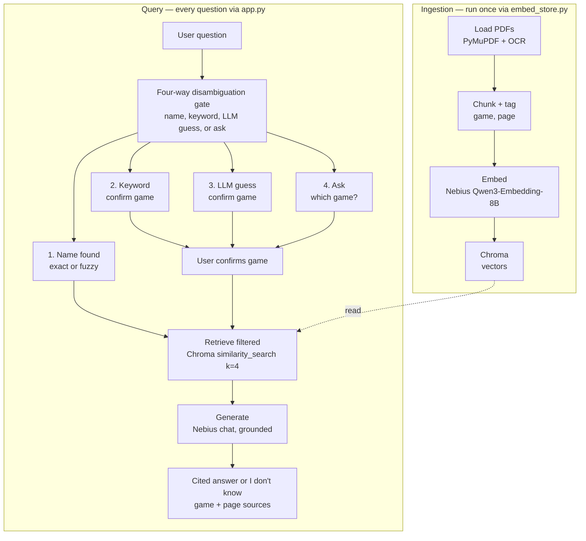

# 🎲 Board Game Rules Bot

A Retrieval-Augmented Generation (RAG) assistant that answers rules questions
about board games from their official rulebooks. Ask a question, get a grounded
answer with a citation — and if the question is ambiguous, the bot asks which
game you mean instead of guessing.

**Games currently supported:** Catan, Saboteur, Evolution, Sequence, Spot It (Dobble)

## What makes it different
- **Grounded answers only** — responses come from the rulebooks, with game + page citations.
- **Honest refusals** — if the answer isn't in the rules, it says "I don't know" rather than inventing one.
- **Disambiguation gate** — for questions that span multiple games ("how many cards do I start with?"), it asks which game instead of guessing.

## Project structure
| File | What it does |
|------|--------------|
| `embed_store.py` | Ingestion: loads the PDFs, OCRs image-only pages, chunks, tags metadata (game/page), embeds via Nebius, and stores vectors in Chroma. **Run this once to build the database.** |
| `app.py` | The Streamlit web app — the chat interface, the disambiguation gate, and answer generation. **This is the main app.** |
| `golden_set.py` | The 15-question evaluation set (ground truth: each question's expected behavior and source). |
| `evaluate.py` | Runs all 15 golden questions, scores retrieval (recall@k), and prints answers for review. |
| `data/raw/` | The source rulebook PDFs. |
| `chroma_db/` | The stored vector database (generated by `embed_store.py`). |

## How it works (pipeline)

1. **Load & OCR** rulebook PDFs (image-only pages are OCR'd with Tesseract).
2. **Chunk** into ~800-character pieces, tagged with `game` and `page`.
3. **Embed** each chunk via Nebius (`Qwen/Qwen3-Embedding-8B`).
4. **Store** vectors locally in Chroma.
5. **Retrieve** the most relevant chunks for a question.
6. **Gate**: answer directly, infer-and-state-assumption, or ask which game.
7. **Generate** a grounded answer (via Nebius chat model) with citations.

## Setup & run locally
1. Clone the repo and enter it:
git clone https://github.com/YOUR_USERNAME/boardgame-rag.git
cd boardgame-rag

2. Create a virtual environment and install dependencies:
python3 -m venv venv
source venv/bin/activate      # Windows: venv\Scripts\activate
pip install -r requirements.txt

3. Install Tesseract (for OCR of image-based rulebooks):
brew install tesseract        # macOS

4. Add your Nebius API key. Create `.streamlit/secrets.toml`:
NEBIUS_API_KEY = "your-key-here"
APP_PASSWORD = "your-chosen-password"

5. Build the database (one time):
python3 embed_store.py

6. Run the app:
streamlit run app.py

## Deployment (Streamlit Community Cloud)
1. Push the repo to GitHub (including `chroma_db/`).
2. Go to share.streamlit.io, sign in with GitHub, and **Create app** from this repo.
3. Set the main file to `app.py`.
4. Under **Advanced settings → Secrets**, add `NEBIUS_API_KEY` and `APP_PASSWORD`.
5. Deploy. The app is password-protected so only people you share the password with can use it.

## Adding more games in the future
This bot is designed to grow. To add a new game:
1. Drop its rulebook PDF into `data/raw/`.
2. Add the game's name and any aliases to the `GAME_ALIASES` dictionary in `app.py` (and `evaluate.py`).
3. Re-run `python3 embed_store.py` to rebuild the database with the new game included.
4. (Optional) Add a few questions for the new game to `golden_set.py` and re-run the eval.

No other code changes are needed — the chunking, metadata tagging, and the
disambiguation gate all handle new games automatically.

## Evaluation
See `evaluate.py` and the writeup for the 15-question evaluation, retrieval
scores (recall@k), and failure analysis.

## Tech stack
LangChain · Chroma (vector store) · Nebius Token Factory (embeddings + generation) · Tesseract (OCR) · Streamlit (UI)
Replace YOUR_USERNAME with your GitHub username in two spots.
